# BogotaMobility

## Description

The bogota mobility project has the powers to manage people with their respective vehicles and their respective fines, this within a MySql database, using a spring boot API and a web page with JSF 3.0. finally, if you need instructions to be able to use the application (already executed) you can watch the following video.

### [Video](https://youtu.be/FobGG7UneU0)

## Program execution screenshots

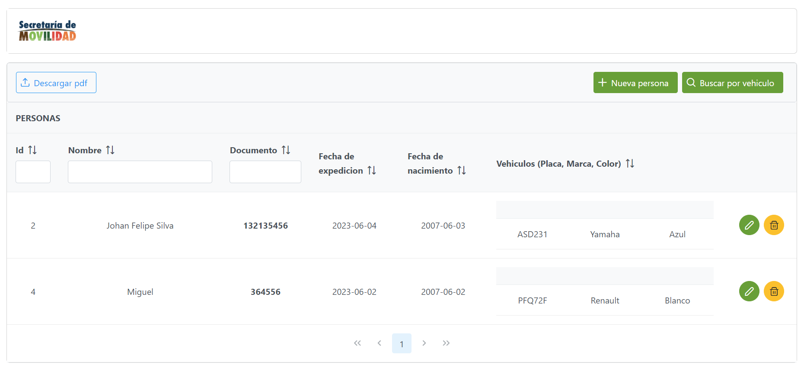
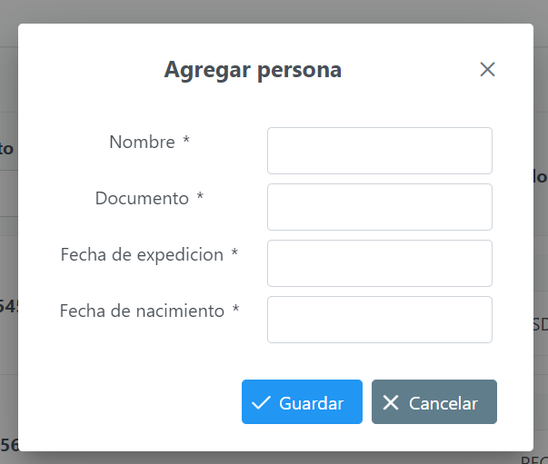
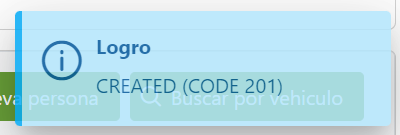
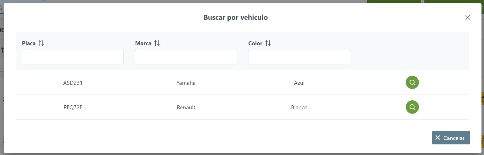
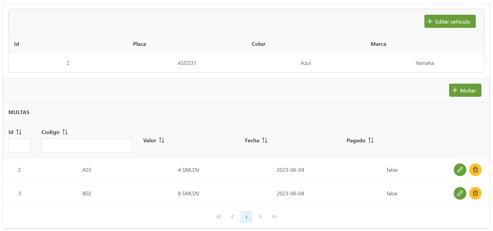
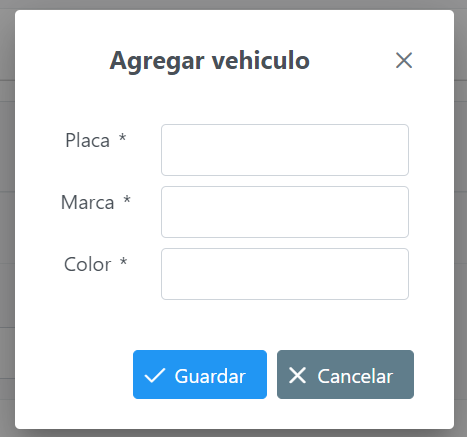
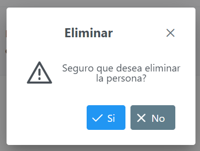
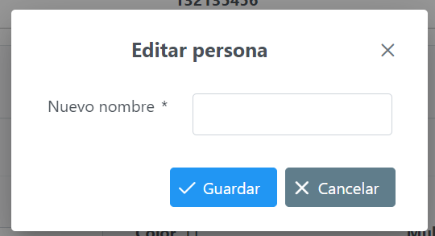
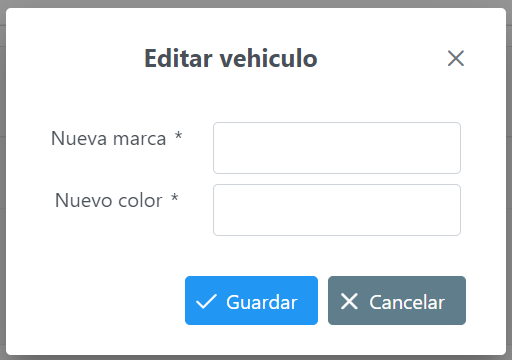
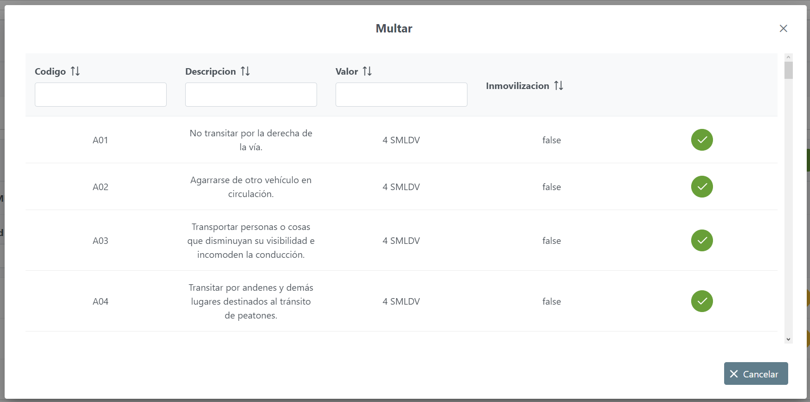
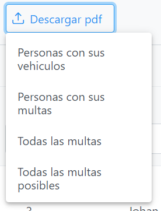
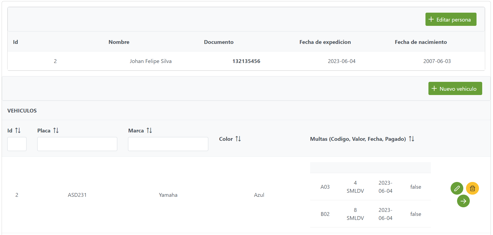
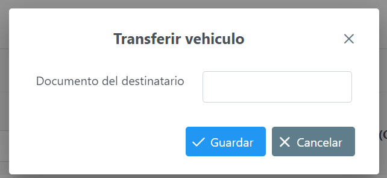

# MovilidadBogota

### [Video](https://youtu.be/FobGG7UneU0)

## Descripcion

El proyecto movilidad bogota tiene como facultades administrar las personas con sus respectivos vehiculos y sus respectivas multas, esto dentro de una base de datos MySql, usando una API de spring boot y una pagina web con JSF 3.0. finalmente, si necesita instrucciones para poder utilizar el aplicativo (ya ejecutado) puede ver el siguiente video.

## Capturas de pantalla de ejecucion del programa

